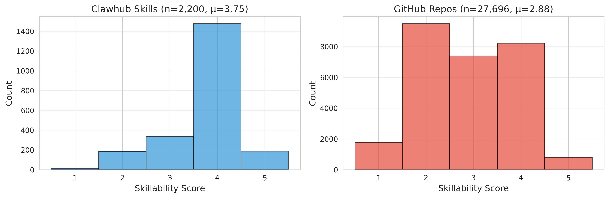
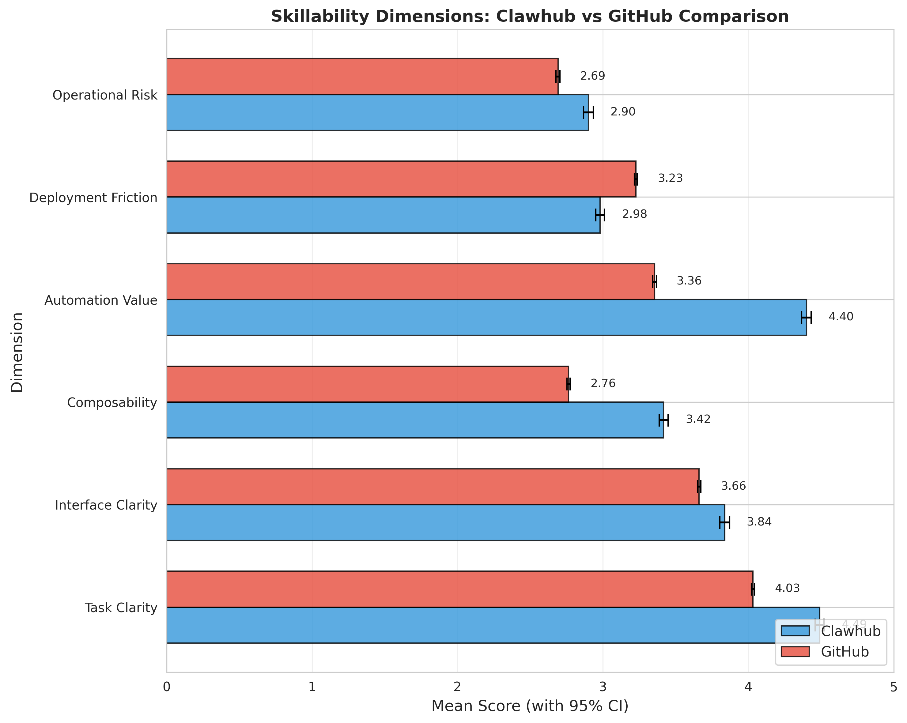
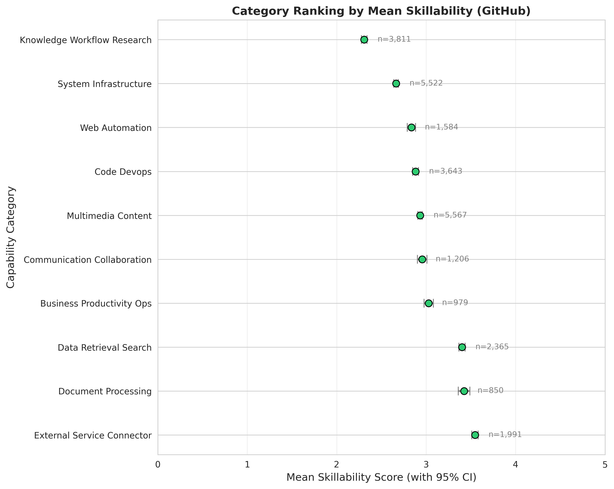
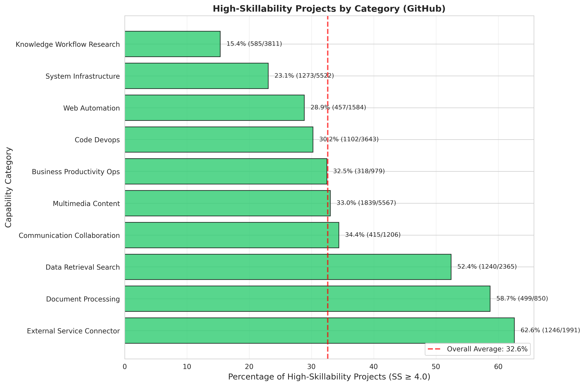
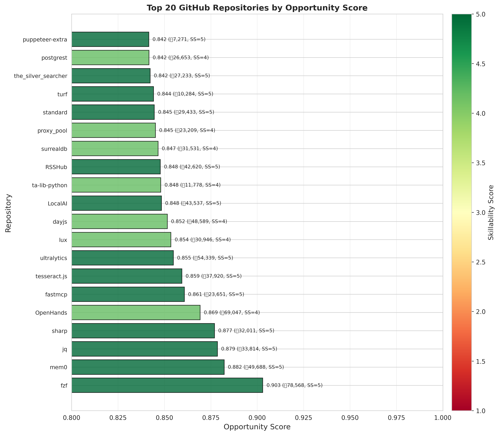
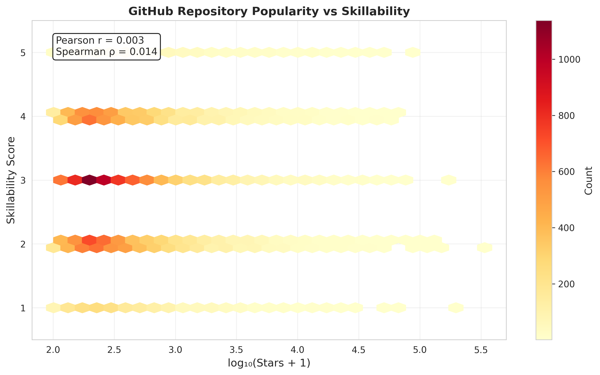

# From Software Repositories to Agent Skills: An Exploratory Empirical Study of Skillability in Open-Source Ecosystems

**Anonymous Authors**

## Abstract

AI agent ecosystems increasingly rely on reusable "skills", but deciding which open-source software projects are worth converting into skills remains largely ad hoc. We present an exploratory empirical study of **29,896 artifacts**: 2,200 skills from the Clawhub marketplace and 27,696 GitHub repositories sampled from a larger filtered corpus. We operationalize **skillability** as a six-dimensional construct spanning task clarity, interface clarity, composability, automation value, deployment friction, and operational risk, and annotate artifacts with an LLM-based pipeline over metadata and README excerpts, validated on a 200-item human-coded subsample (87% agreement within +/-0.5 points).

The results reveal a large and structured conversion frontier. Marketplace skills score substantially higher than sampled GitHub repositories (3.75 vs. 2.88; Delta = 0.87, Welch's t-test p < 0.001, Cohen's d = 0.74), and **35.8%** of all analyzed artifacts satisfy our high-skillability threshold. High-skillability candidates concentrate in **Data Retrieval & Search, Multimedia Content, and System Infrastructure**, while raw skillability is effectively independent of repository popularity (Spearman r_s = 0.003). Using skillability together with lightweight repository-quality signals, we identify **9,033 GitHub repositories** as promising skill-conversion candidates.

We position the paper as a scalable empirical foundation for repository-to-skill pipelines rather than as a finalized measurement paper. The contribution is a reusable rubric, a large-scale characterization of agent-facing software, and concrete evidence that open-source ecosystems contain enough high-potential repositories to make systematic and potentially batch-oriented skillification a realistic next step.

**Keywords:** AI agents, software reuse, repository mining, skill marketplaces, empirical software engineering

---

## 1. Introduction

Large language model based agents are changing how software is consumed. Instead of calling libraries directly or integrating APIs manually, agents increasingly rely on higher-level tools and "skills" that expose useful capabilities through descriptions, schemas, and invocation interfaces [1,2]. This shift creates a new software engineering problem: some software projects are much easier than others to expose as agent-usable skills, but we still lack systematic ways to identify them at scale.

Today, skill creation is mostly opportunistic. Developers manually browse open-source repositories, select projects that appear useful for agents, wrap them with platform-specific interfaces, and publish them to marketplaces such as Clawhub or MCP-based registries [34,35]. That workflow does not scale well. GitHub hosts an enormous supply of potentially reusable software [3], but only a small fraction has been adapted for agent use. For marketplace operators, this means missing high-value capabilities. For software developers, it means little guidance on what design choices make a project more agent-friendly.

This paper studies that gap through the lens of **skillability**: the extent to which a software project appears suitable for transformation into an agent-facing skill. We intentionally frame skillability as an **exploratory construct** rather than a finalized quality metric. Our goal is not to present a finished measurement instrument, but to provide a structured and scalable basis for the next stage of work: discovering, prioritizing, and eventually industrializing the conversion of open-source repositories into agent-usable skills.

The distinction matters. A repository can be high quality, influential, and technically sophisticated while still being a poor candidate for packaging as a standalone skill. The Linux kernel is indispensable software, but its broad scope, operational risk, and deep environment coupling make it difficult to expose as a focused agent skill. By contrast, tools such as `jq` or `fzf` have narrow purposes, clear interfaces, and immediate automation value. Traditional indicators such as stars or community size do not capture this difference well.

From a software engineering perspective, the problem sits at the intersection of software reuse, API usability, repository mining, and emerging agent ecosystems. Prior work has studied reusable components, software ecosystems, and tool use in LLM agents [4,5,13,27], but there is still little empirical evidence on what kinds of open-source software are most amenable to agent-facing reuse. That is the gap we address.

We make four contributions.

1. We operationalize an exploratory six-dimensional skillability construct that captures task clarity, interface clarity, composability, automation value, deployment friction, and operational risk.
2. We build and analyze a 29,896-artifact dataset spanning both an agent skill marketplace and sampled GitHub repositories, using LLM-assisted annotation with human spot validation.
3. We report ecosystem-scale findings on how skillability is distributed across repositories, domains, languages, and granularities, showing that promising candidates are concentrated rather than rare.
4. We derive a practical opportunity-ranking heuristic and identify concrete high-potential repository candidates for skill transformation, establishing an actionable starting point for large-scale or semi-automated repository-to-skill conversion pipelines.

The remainder of the paper is organized as follows. Section 2 positions the work against related literature. Section 3 describes the study design, data collection, annotation procedure, and analysis strategy. Section 4 reports the results. Section 5 discusses implications and threats to validity. Section 6 concludes.

---

## 2. Background and Related Work

### 2.1 Software Reuse and Componentization

Software reuse has been a core concern of software engineering since McIlroy's call for mass-produced software components [4]. Component-based development and related paradigms emphasize encapsulation, interface contracts, and composability [5,6,7]. Empirical work on reuse has repeatedly highlighted clear specifications, stable interfaces, modularity, and low coupling as enabling factors [8,9,10]. Our study builds on that tradition, but shifts the consumer from a human developer to an autonomous or semi-autonomous agent.

This shift changes the operational requirements of reuse. An agent-facing component must not only be functionally reusable; it must also be easy for a model to discover, understand from textual and structured descriptions, and invoke safely. These are not identical to classical reuse concerns, even though they overlap.

### 2.2 Software Ecosystems and Repository Mining

Software ecosystem research studies collections of interdependent projects, developers, and users that evolve in a shared environment [13,14]. Repository mining has provided methods for characterizing large corpora, measuring project health, and identifying suitable samples for empirical studies [15,16,17,18,19]. Our work adopts that empirical mindset, but focuses on a new selection problem: which repositories appear especially promising for downstream reuse in agent ecosystems.

This problem is close to, but distinct from, repository popularity prediction or quality assessment. Popular repositories may be broad platforms, frameworks, or applications whose value does not translate into skill packaging. Conversely, small but focused tools may be highly promising. The study therefore complements prior mining work by introducing a different target construct.

### 2.3 API Usability, Tool Use, and Agent Interfaces

API usability research shows that interface design strongly affects learnability, adoption, and developer productivity [22,23,24,25,26]. Many of the same principles matter for agent consumption: explicit parameters, predictable behavior, and good documentation reduce ambiguity during tool selection and invocation. Recent work on LLM tool use, including Toolformer, ReAct, Gorilla, and related systems, has focused primarily on the agent side of the problem: how models decide when and how to call tools [27,28,29,33]. Our study complements that literature by looking at the *software side*: what properties of a software artifact make it easier to expose as a tool in the first place.

### 2.4 Skill Marketplaces and Emerging Agent Ecosystems

Skill marketplaces such as Clawhub and standards such as the Model Context Protocol represent early infrastructure for distributing agent-usable capabilities [34,35]. These ecosystems face curation, recommendation, and duplication problems that resemble app stores and package registries, but with an important difference: the primary consumer may be an automated agent rather than a human user [36,37,38]. This raises new questions about discoverability and interface semantics that conventional marketplace quality signals may not capture.

### 2.5 Measurement and LLM-Based Annotation

Software measurement research emphasizes construct validity, reliability, and the need to avoid overclaiming beyond what an instrument can support [41,42]. These concerns are especially important here because skillability is not yet a mature construct. At the same time, large-scale annotation of tens of thousands of repositories is impractical without automation. Recent work suggests that LLMs can support annotation and evaluation workflows efficiently, though concerns remain about bias, consistency, and validity [43,44,45]. Our study adopts LLM-assisted coding for scale, but treats the results as exploratory evidence and explicitly discusses the threats this introduces.

### 2.6 Gap and Positioning

Taken together, prior work gives us strong foundations for studying software reuse, interfaces, and ecosystems, but leaves three gaps. First, the literature does not yet provide an agent-centric characterization of reusable software components. Second, empirical evidence on skill marketplaces remains limited. Third, current skill discovery practices are still ad hoc. We position this paper as an exploratory empirical study that addresses those gaps by operationalizing a preliminary construct and using it to characterize a large cross-ecosystem corpus.

---

## 3. Study Design

### 3.1 Research Questions

We study four research questions.

**RQ1. How can software be characterized for agent-facing reuse?**  
We operationalize an exploratory skillability construct and examine the behavior of its six dimensions.

**RQ2. How do marketplace skills differ from sampled GitHub repositories?**  
We compare Clawhub skills and GitHub repositories descriptively, while explicitly accounting for confounds.

**RQ3. Where are high-skillability projects concentrated?**  
We analyze distributions across capability categories, languages, and artifact granularities.

**RQ4. Which repositories appear most promising for skill transformation?**  
We combine skillability with lightweight repository quality signals to rank practical candidates.

### 3.2 Skillability Construct

We define skillability using six dimensions scored on a 1-5 scale.

1. **Task Clarity (TC):** how focused and well-bounded the software's purpose appears.
2. **Interface Clarity (IC):** how explicit and understandable the invocation interface appears.
3. **Composability (C):** how naturally the artifact fits into larger workflows.
4. **Automation Value (AV):** how much useful manual effort the artifact appears to remove.
5. **Deployment Friction (DF):** how difficult the artifact appears to deploy and maintain.
6. **Operational Risk (OR):** how risky fully automated execution appears to be.

For DF and OR, higher raw scores mean *worse* conditions (more friction, more risk). We therefore reverse-code them before aggregation:

```text
DF' = 6 - DF
OR' = 6 - OR

SS = 0.25*TC + 0.20*IC + 0.20*C + 0.25*AV + 0.05*DF' + 0.05*OR'
```

This formulation keeps the overall **Skillability Score (SS)** in the range [1, 5] because the weights sum to 1.0 and all aggregated dimensions are coded in the same direction (higher is better). We use a threshold of `SS >= 4.0` to denote **high skillability**. We treat that threshold as a practical analysis cutoff rather than a validated boundary.

The weighting scheme reflects our design judgment that task clarity and automation value are especially important for agent-facing reuse, while deployment friction and operational risk matter but can sometimes be mitigated through sandboxing, wrappers, or hosted execution. Because these weights are heuristic, we later report a sensitivity analysis.

### 3.3 Capability Taxonomy

To support domain-level analysis, we classify each project into one of ten primary capability categories plus an "Other" fallback bucket for artifacts that do not fit cleanly:

1. Code & DevOps
2. Data Retrieval & Search
3. Document Processing
4. Web Automation
5. Communication & Collaboration
6. Knowledge & Workflow
7. Business & Productivity
8. Multimedia Content
9. System Infrastructure
10. External Service Connectors

We also record artifact **granularity** (primitive tool, service wrapper, workflow skill, platform adapter) and **execution mode** (local deterministic, remote API mediated, browser mediated, human in the loop, hybrid). Appendix B provides the operational definitions.

### 3.4 Dataset Construction

We combined two data sources.

**Clawhub skills.** We collected metadata and skill specifications for 22,413 Clawhub skills as of March 2026 and drew a 2,200-item stratified sample.

**GitHub repositories.** We collected 347,860 repositories from GitHub and filtered them to repositories with at least 10 stars, activity within the previous two years, a README file, and non-archived status. We then drew a 27,700-item stratified sample and retained 27,696 valid annotations after response filtering.

The study therefore analyzes **29,896 artifacts** in total. Our scope is intentionally narrower than "all software projects": the sampling frame emphasizes active, documented, community-visible artifacts. This is appropriate for our goal of identifying realistic conversion candidates, but it limits generalizability.

Table 1 summarizes the analyzed corpus.

**Table 1. Dataset overview**

| Metric | Clawhub | GitHub | Total |
|---|---:|---:|---:|
| Projects | 2,200 | 27,696 | 29,896 |
| Mean stars | 847 | 1,843 | 1,770 |
| Median stars | 156 | 127 | 129 |
| Languages | 42 | 87 | 89 |
| Capability categories | 10 + Other | 10 + Other | 10 + Other |

### 3.5 LLM-Assisted Annotation

Because manual coding of nearly 30,000 artifacts is infeasible, we used Alibaba Qwen-Plus (`qwen-plus-2024-11`) to score each artifact and assign taxonomy labels. Each prompt included repository metadata, a README excerpt capped at 3,000 characters, a detailed scoring rubric, and a constrained JSON schema. We used temperature 0.1, schema validation, and retry logic for malformed outputs.

The annotation pipeline produced valid outputs for 29,896 of 29,900 sampled artifacts (99.99%). Full prompt details are provided in Appendix A.

### 3.6 Human Validation

We conducted a spot-validation study on 200 randomly sampled artifacts (100 Clawhub, 100 GitHub). Two human annotators independently applied the same rubric and compared their judgments with the model outputs.

The LLM agreed with the human reference within +/-0.5 points in **87%** of cases overall. Per-dimension agreement ranged from 84% (Composability) to 91% (Automation Value). Disagreements most often occurred when README excerpts were insufficient to judge interface structure or integration constraints. This validation is useful but limited: it is not a full reliability study, and it does not establish convergent or predictive validity in the measurement-theory sense.

### 3.7 Analysis Procedures

We use four analysis procedures aligned with the research questions.

1. **Descriptive characterization.** We summarize distributions, means, and high-skillability rates.
2. **Cross-group comparison.** We compare Clawhub and GitHub using Welch's t-test, confidence intervals, and Cohen's d. Because the dataset is large and non-normal, we also check bootstrap confidence intervals.
3. **Association analysis.** We use Spearman correlation for star-related analyses because repository stars are highly skewed.
4. **Opportunity ranking.** For GitHub repositories, we compute a prioritization heuristic:

```text
OpportunityScore = 0.6 * normalize(SS) + 0.4 * RepoQuality
```

where `RepoQuality` combines log-scaled stars, recency, README length, and license presence. We use this score as a practical prioritization device for downstream conversion workflows rather than as a standalone scientific claim about repository value.

As a supplementary check, we also train classifiers to distinguish Clawhub skills from GitHub repositories using metadata alone versus metadata plus skillability features. We report that analysis as supporting evidence about construct utility, not as proof that skillability predicts real-world success.

---

## 4. Results

### 4.1 RQ1: Characterizing Skillability

Across all 29,896 artifacts, the mean skillability score is **2.95** (SD = 1.18). A total of **10,698 artifacts (35.8%)** satisfy `SS >= 4.0`.

Figure 1 shows the overall score distributions for Clawhub and GitHub. The Clawhub distribution is concentrated in the upper-middle range, whereas GitHub repositories span the full scale more broadly.



Table 2 reports the per-dimension statistics. For the negatively oriented raw dimensions (Deployment Friction and Operational Risk), lower values are better.

**Table 2. Dimension-level statistics**

| Dimension | Mean | SD | Clawhub mean | GitHub mean | Delta (Clawhub - GitHub) | Cohen's d |
|---|---:|---:|---:|---:|---:|---:|
| Task Clarity | 4.07 | 0.95 | 4.49 | 4.03 | +0.46 | 0.49 |
| Interface Clarity | 3.67 | 0.93 | 3.84 | 3.66 | +0.18 | 0.19 |
| Composability | 2.81 | 0.94 | 3.42 | 2.76 | +0.66 | 0.70 |
| Automation Value | 3.43 | 1.09 | 4.40 | 3.36 | +1.04 | 0.95 |
| Deployment Friction | 3.21 | 0.84 | 2.98 | 3.23 | -0.25 | -0.30 |
| Operational Risk | 2.71 | 1.08 | 2.90 | 2.69 | +0.21 | 0.19 |

Three descriptive patterns stand out. First, **Task Clarity** is high across the corpus, suggesting that many repositories communicate a focused purpose even when they are not ideal skill candidates. Second, **Automation Value** shows the largest marketplace-repository gap, which fits the intuition that packaged skills are often created for repetitive high-value tasks. Third, **Composability** also differentiates the two groups strongly, consistent with marketplace artifacts being intentionally wrapped for integration.

Figure 2 presents the same comparison with confidence intervals.



We also computed descriptive correlations between each raw dimension and the composite score: Automation Value (0.850), Task Clarity (0.805), Composability (0.767), Interface Clarity (0.686), Deployment Friction (-0.080), and Operational Risk (-0.099). These numbers should be read cautiously: because the composite score is built from these dimensions, they are useful as a sanity check on the weighting scheme, not as independent empirical findings.

### 4.2 RQ2: Marketplace Skills vs. GitHub Repositories

Clawhub skills have a mean skillability of **3.75** (SD = 0.82), whereas sampled GitHub repositories average **2.88** (SD = 1.21). The mean difference is **0.87** with 95% CI [0.81, 0.93]; Welch's t-test yields `p < 0.001`, and the effect size is **Cohen's d = 0.74**. Bootstrap confidence intervals closely match the parametric interval.

The high-skillability rate also differs markedly:

- Clawhub: 75.7% score >= 4.0
- GitHub: 32.6% score >= 4.0

This difference is substantial, but it is not clean evidence that marketplace artifacts are inherently "better software." At least three confounds are built into the comparison.

1. **Documentation confound.** Clawhub skills usually expose purpose-built, structured descriptions intended for agent consumption. GitHub README quality is much more heterogeneous.
2. **Selection confound.** Marketplace skills are already curated and intentionally packaged for agent use.
3. **Scope confound.** The GitHub sample includes large frameworks, end-user applications, and infrastructure projects that are not natural single-skill candidates.

For that reason, we interpret RQ2 as a **descriptive ecosystem contrast**. It shows that marketplace artifacts and general repositories occupy different regions of the skillability space, but it does not isolate the cause of those differences.

### 4.3 RQ3: Where High-Skillability Projects Concentrate

We next examine where promising projects cluster in the GitHub sample.

**Capability categories.** Table 3 shows the distribution by capability category. Data Retrieval & Search, Multimedia Content, and System Infrastructure exhibit the highest mean skillability scores and the highest shares of `SS >= 4.0`.

Figure 3 complements the table by ranking categories with uncertainty bands. The visual pattern is important for the paper's main narrative: the high-opportunity portion of the repository landscape is structured rather than diffuse, which means future large-scale skillification efforts can begin from a relatively clear empirical target map.



**Table 3. Capability-category distribution in the GitHub sample**

| Category | Count | % | Mean SS | SD | High-skillability % (>= 4.0) | Cohen's d vs. GitHub overall |
|---|---:|---:|---:|---:|---:|---:|
| Data Retrieval & Search | 2,365 | 8.5 | 3.42 | 1.08 | 48.3 | 0.40 |
| Multimedia Content | 5,567 | 20.1 | 3.38 | 1.12 | 46.1 | 0.36 |
| System Infrastructure | 5,522 | 19.9 | 3.31 | 1.15 | 44.2 | 0.36 |
| Document Processing | 850 | 3.1 | 3.28 | 1.09 | 43.8 | 0.34 |
| Web Automation | 1,584 | 5.7 | 3.19 | 1.14 | 41.2 | 0.26 |
| Communication & Collaboration | 1,206 | 4.4 | 3.15 | 1.11 | 40.1 | 0.23 |
| Code & DevOps | 3,643 | 13.2 | 3.08 | 1.21 | 38.4 | 0.17 |
| Business & Productivity | 979 | 3.5 | 2.94 | 1.18 | 34.2 | 0.05 |
| Knowledge & Workflow | 3,811 | 13.8 | 2.87 | 1.22 | 32.1 | -0.01 |
| External Service Connectors | 1,991 | 7.2 | 2.71 | 1.16 | 28.9 | -0.14 |
| Other | 178 | 0.6 | 2.65 | 1.25 | 27.3 | -0.19 |

These category-level results support a simple interpretation: high-skillability artifacts are most common where tasks are bounded, interfaces are explicit, and automation value is obvious. Data access tools, media processing libraries, and infrastructure utilities fit that profile well. By contrast, connector-style projects often inherit authentication, rate limiting, and external dependency complexity that makes fully autonomous use less straightforward.

Figure 4 shows the same result from a thresholded perspective. This view is useful if the goal is not only to characterize the ecosystem, but to estimate where a practical conversion pipeline is likely to yield many viable skills with limited screening overhead.



**Programming languages.** Language effects are present but smaller than category effects:

| Language | Mean SS | SD | High-skillability % | n |
|---|---:|---:|---:|---:|
| Python | 3.12 | 1.18 | 41.2 | 5,214 |
| Go | 3.08 | 1.15 | 39.8 | 1,358 |
| TypeScript | 3.05 | 1.12 | 38.9 | 2,142 |
| JavaScript | 2.98 | 1.19 | 37.1 | 3,347 |
| Java | 2.87 | 1.23 | 34.2 | 1,682 |
| C++ | 2.71 | 1.28 | 29.8 | 1,465 |

Python and Go are slightly more favorable in our sample, plausibly because they are common in tooling, automation, and infrastructure domains. We do not interpret language as a causal driver; domain composition and deployment characteristics are likely doing much of the work.

**Granularity.** Artifact granularity shows a clearer pattern:

- Primitive tools: 13,239 artifacts (47.8%), mean SS = 3.45
- Service wrappers: 8,414 artifacts (30.4%), mean SS = 3.21
- Workflow skills: 3,414 artifacts (12.3%), mean SS = 3.08
- Platform adapters: 2,620 artifacts (9.5%), mean SS = 2.87
- Other: 9 artifacts (<0.1%), mean SS = 2.65

Primitive tools are the strongest candidates overall, which is consistent with long-standing software reuse intuition: smaller, clearer, and more bounded artifacts are easier to compose and automate.

### 4.4 RQ4: Promising Repositories for Skill Transformation

Applying `SS >= 4.0` together with `OpportunityScore >= 0.7` yields **9,033 GitHub repositories** that we consider promising skill-conversion candidates. This is the most practically consequential result of the paper: even under a conservative ranking rule, the open-source ecosystem appears to contain a substantial inventory of repositories that could plausibly be transformed into agent skills at scale.

The score distribution is:

- >= 0.9: 1,247 repositories (4.5%)
- 0.8 to 0.9: 2,891 repositories (10.4%)
- 0.7 to 0.8: 4,895 repositories (17.7%)
- < 0.7: 18,663 repositories (67.4%)

Figure 5 makes this opportunity space concrete by showing the top-ranked repositories. The figure serves an important demonstration purpose: the candidate set is not abstract, but already contains recognizable and practically valuable software that could anchor future batch skillification experiments.



Table 4 lists selected examples across categories. The table is intentionally illustrative rather than exhaustive.

**Table 4. Selected high-opportunity repositories**

| Category | Repository | Stars | SS | Opportunity score | Why it appears promising |
|---|---|---:|---:|---:|---|
| Data Retrieval & Search | `junegunn/fzf` | 78,568 | 5.00 | 0.903 | Focused CLI tool, clear stdin/stdout model, deterministic local execution |
| Data Retrieval & Search | `jqlang/jq` | 33,814 | 5.00 | 0.879 | Declarative JSON transformation, strong composability, minimal side effects |
| Multimedia Content | `lovell/sharp` | 32,011 | 5.00 | 0.877 | Clear API for image processing, strong automation value, predictable outputs |
| Multimedia Content | `ultralytics/ultralytics` | 54,339 | 5.00 | 0.855 | Structured computer-vision workflows exposed through documented interfaces |
| System Infrastructure | `giampaolo/psutil` | 10,000 | 4.75 | 0.860 | Typed system-inspection API with obvious monitoring and automation uses |
| System Infrastructure | `gorakhargosh/watchdog` | 6,400 | 4.62 | 0.820 | Event-driven file monitoring suited to workflow composition |
| Document Processing | `naptha/tesseract.js` | 37,920 | 5.00 | 0.859 | Self-contained OCR with clear inputs, outputs, and confidence scores |
| Document Processing | `py-pdf/pypdf` | 4,800 | 4.62 | 0.790 | Deterministic PDF manipulation with high routine automation value |
| Code & DevOps | `OpenHands/OpenHands` | 69,047 | 4.00 | 0.869 | Strong automation relevance and explicit interfaces, despite larger scope |
| External Service Connectors | `PrefectHQ/fastmcp` | 23,651 | 5.00 | 0.861 | Explicit schema generation and tool-wrapping support for agent ecosystems |
| Knowledge & Workflow | `mem0ai/mem0` | 49,688 | 5.00 | 0.882 | Focused memory abstraction with clear agent-facing use cases |

Popularity is a poor proxy for raw skillability. In the GitHub sample, the correlation between **skillability** and **stars** is effectively zero (`r_s = 0.003`, `p = 0.62`). This is one of the most strategically useful findings in the paper: a repository-to-skill pipeline that relies only on popularity signals would overlook a large share of the available opportunity space.

Figure 6 visualizes this disconnect directly. High-skillability repositories appear across the full popularity range, including many projects far below the top-starred tier. This pattern is consistent with the paper's intended role as the front-end stage of a discovery pipeline rather than a mechanism for simply re-identifying already dominant repositories.



By contrast, the correlation between **OpportunityScore** and **stars** is weakly positive (`r_s = 0.138`, `p < 0.001`) because stars are intentionally included in the ranking heuristic. That distinction matters. The first result supports the construct-level claim; the second simply confirms that the prioritization heuristic partly rewards repository quality signals.

### 4.5 Supplementary Check: Discriminating Marketplace Membership

As a supplementary analysis, we trained binary classifiers to distinguish Clawhub skills from GitHub repositories. The goal is modest: to test whether the skillability features carry useful signal beyond simple repository metadata. This is **not** an adoption study in the causal sense, because marketplace membership also reflects curation policy, documentation format, and platform-specific packaging decisions.

Using only basic metadata (`has_license`, `archived`), XGBoost achieved **AUC = 0.8801** (95% CI [0.8701, 0.8901]). Adding the six skillability dimensions plus taxonomy features increased performance to **AUC = 0.9863** (95% CI [0.9831, 0.9894]) and improved PR-AUC from **0.2489** to **0.8360**. SHAP and ablation analyses consistently ranked **Automation Value**, **Composability**, and **Task Clarity** as the most informative features.

We interpret this result narrowly: the construct appears to align with the practical distinctions that separate marketplace artifacts from general repositories. That supports the utility of the rubric, but it does not validate the construct against downstream agent task success.

---

## 5. Discussion

### 5.1 What the Results Suggest

Three findings appear most robust.

First, the space of agent-friendly software is non-trivial. Even under a conservative and imperfect measurement process, roughly one third of the analyzed corpus crosses the high-skillability threshold. That suggests not just headroom for better curation, but the feasibility of a broader pipeline in which repositories are discovered, screened, wrapped, and published as skills in a much more systematic way than current marketplace practice.

Second, the most promising candidates are not distributed uniformly across software domains. Repository categories centered on focused transformations, data access, media processing, and system inspection contain the densest pockets of promising artifacts. This gives future work an empirical map of where batch skillification efforts are most likely to succeed first.

Third, popularity and skillability are not the same thing. The near-zero star correlation suggests that common open-source visibility signals are poorly aligned with the specific needs of agent-facing reuse. This has direct practical implications: curation strategies that simply rank by stars are likely to miss many viable skill candidates, whereas a dedicated discovery layer can surface a much larger conversion frontier.

### 5.2 Implications

**For marketplace operators.** A rubric like skillability can support not only first-pass scouting, but also staged acquisition pipelines: identify candidates, prioritize them by expected conversion payoff, and focus packaging resources on categories with the highest expected yield. The current results suggest starting with data retrieval, multimedia, document processing, and infrastructure-heavy categories, where focused automation value is common.

**For repository maintainers.** Projects that aim to be agent-friendly should optimize for focused scope, explicit interfaces, deterministic behavior where possible, and operationally safe defaults. Better documentation matters not only for humans, but also for machine-mediated reuse.

**For tool and agent platform designers.** The strong separation on automation value and composability suggests that wrapper generation, schema extraction, execution isolation, and deployment templating are especially important leverage points. In other words, our findings point toward a concrete systems agenda: tools that reduce packaging overhead could turn high-SS repositories into skills in semi-automated or even batch-oriented ways.

**For researchers.** The paper does not end the measurement question; it opens a broader pipeline question. A promising next step is to connect repository-level annotations to downstream agent task outcomes, tool-call success, wrapping effort, and marketplace adoption so that the field can move from descriptive ranking to end-to-end repository-to-skill engineering.

### 5.3 Threats to Validity

We structure the main threats using standard empirical-software-engineering validity categories.

**Construct validity.** Skillability is an exploratory construct defined by our rubric and weighting choices. Although the dimensions are grounded in software reuse and agent-tool requirements, they are not yet validated through factor analysis, expert consensus methods, or external outcome measures. The `SS >= 4.0` threshold is also heuristic.

**Internal validity.** The comparison between Clawhub and GitHub is confounded by curation, documentation format, and artifact scope. The supplementary classifier may partially exploit the same differences. These analyses therefore support descriptive and discriminative claims, not causal ones.

**Conclusion validity.** We report effect sizes and confidence intervals, and we use rank-based correlation where the data are highly skewed. Even so, the analyses inherit measurement error from the annotation pipeline. Because the study is exploratory, we do not apply family-wise multiple-testing corrections and avoid strong confirmatory interpretations.

**External validity.** Our GitHub sampling frame excludes very new, low-visibility, undocumented, or archived repositories. The results therefore generalize to a more practical but narrower population: actively maintained and documented open-source projects with some level of community validation.

**Annotation validity.** The LLM sees repository metadata and README excerpts rather than code, tests, dependency graphs, or runtime behavior. As a result, scores for interface clarity, deployment friction, and operational risk can be wrong in either direction. The 200-item validation study provides useful evidence of approximate alignment, but not full annotation reliability.

### 5.4 Future Work

We see four concrete next steps.

1. **Stronger construct validation.** Expert panels, factor analysis, and agreement studies with multiple human annotators could test whether the six dimensions hold together as intended.
2. **Outcome-based validation.** The most important follow-up is to correlate skillability with downstream agent performance: tool-call success, task completion, failure recovery, wrapping effort, and user-perceived utility.
3. **Batch skillification pipelines.** A natural next step is to build and evaluate end-to-end workflows that take high-SS repositories, generate wrappers and interface schemas, provision execution environments, and measure how many can be converted into usable skills with limited human intervention.
4. **Richer evidence sources and matched studies.** Future versions should incorporate code structure, API schemas, tests, dependency graphs, container metadata, and security signals rather than README text alone. A matched comparison between marketplace skills and GitHub repositories with similar documentation quality would better isolate ecosystem effects, while longitudinal analysis could test whether highly ranked repositories are later converted into skills.

---

## 6. Conclusion

This paper investigated how open-source software can be characterized for transformation into agent-facing skills. We introduced skillability as an exploratory six-dimensional construct and applied it to 29,896 artifacts spanning both a skill marketplace and GitHub. The study shows that marketplace artifacts and general repositories occupy different regions of the skillability space, that high-skillability candidates are concentrated in a few capability domains, and that repository popularity is a poor proxy for raw skill-conversion potential.

The main claim of the paper is forward-looking: repository-scale discovery of promising skill candidates is feasible, the candidate pool is large enough to matter, and the opportunity space is structured enough to support targeted conversion strategies. In that sense, this work serves as a front-end stage for future repository-to-skill pipelines. It identifies where large-scale or semi-automated skillification is most plausible, what classes of repositories should be prioritized first, and which technical bottlenecks future systems should attack.

We do not present skillability as a finished measurement instrument. We present it as a useful and scalable empirical basis for the next phase of research: moving from repository mining and candidate ranking toward end-to-end systems that can discover, wrap, evaluate, and publish skills in bulk.

---

## References

[1] Wang, L., Ma, C., Feng, X., et al. (2024). "A Survey on Large Language Model based Autonomous Agents." *Frontiers of Computer Science*, 18(6), 186345.

[2] Qian, C., Cong, X., Yang, C., et al. (2023). "Communicative Agents for Software Development." *arXiv preprint arXiv:2307.07924*.

[3] GitHub (2024). "The State of the Octoverse 2024." GitHub Blog. https://github.blog/news-insights/octoverse/

[4] McIlroy, M.D. (1968). "Mass Produced Software Components." In *Software Engineering: Report on a Conference*, NATO Science Committee, pp. 138-155.

[5] Szyperski, C. (2002). *Component Software: Beyond Object-Oriented Programming* (2nd ed.). Addison-Wesley Professional.

[6] Heineman, G.T., and Councill, W.T. (2001). *Component-Based Software Engineering: Putting the Pieces Together*. Addison-Wesley.

[7] Crnkovic, I., Sentilles, S., Vulgarakis, A., and Chaudron, M.R. (2011). "A Classification Framework for Software Component Models." *IEEE Transactions on Software Engineering*, 37(5), 593-615.

[8] Frakes, W.B., and Kang, K. (2005). "Software Reuse Research: Status and Future." *IEEE Transactions on Software Engineering*, 31(7), 529-536.

[9] Krueger, C.W. (1992). "Software Reuse." *ACM Computing Surveys*, 24(2), 131-183.

[10] Morisio, M., Ezran, M., and Tully, C. (2002). "Success and Failure Factors in Software Reuse." *IEEE Transactions on Software Engineering*, 28(4), 340-357.

[11] Pohl, K., Bockle, G., and van der Linden, F.J. (2005). *Software Product Line Engineering: Foundations, Principles and Techniques*. Springer.

[12] Apel, S., and Kastner, C. (2009). "An Overview of Feature-Oriented Software Development." *Journal of Object Technology*, 8(5), 49-84.

[13] Manikas, K., and Hansen, K.M. (2013). "Software Ecosystems - A Systematic Literature Review." *Journal of Systems and Software*, 86(5), 1294-1306.

[14] Bosch, J. (2009). "From Software Product Lines to Software Ecosystems." In *Proceedings of the 13th International Conference on Software Product Lines (SPLC)*, pp. 111-119.

[15] Kagdi, H., Collard, M.L., and Maletic, J.I. (2007). "A Survey and Taxonomy of Approaches for Mining Software Repositories in the Context of Software Evolution." *Journal of Software Maintenance and Evolution*, 19(2), 77-131.

[16] Hassan, A.E. (2008). "The Road Ahead for Mining Software Repositories." In *Proceedings of the Future of Software Maintenance (FoSM)*, pp. 48-57.

[17] Dyer, R., Nguyen, H.A., Rajan, H., and Nguyen, T.N. (2013). "Boa: A Language and Infrastructure for Analyzing Ultra-Large-Scale Software Repositories." In *Proceedings of the 35th International Conference on Software Engineering (ICSE)*, pp. 422-431.

[18] Borges, H., Hora, A., and Valente, M.T. (2016). "Understanding the Factors That Impact the Popularity of GitHub Repositories." In *Proceedings of the 32nd International Conference on Software Maintenance and Evolution (ICSME)*, pp. 334-344.

[19] Munaiah, N., Kroh, S., Cabrey, C., and Nagappan, M. (2017). "Curating GitHub for Engineered Software Projects." *Empirical Software Engineering*, 22(6), 3219-3253.

[20] Decan, A., Mens, T., and Grosjean, P. (2019). "An Empirical Comparison of Dependency Network Evolution in Seven Software Packaging Ecosystems." *Empirical Software Engineering*, 24(1), 381-416.

[21] Kikas, R., Gousios, G., Dumas, M., and Pfahl, D. (2017). "Structure and Evolution of Package Dependency Networks." In *Proceedings of the 14th International Conference on Mining Software Repositories (MSR)*, pp. 102-112.

[22] Piccioni, M., Furia, C.A., and Meyer, B. (2013). "An Empirical Study of API Usability." In *Proceedings of the 7th International Symposium on Empirical Software Engineering and Measurement (ESEM)*, pp. 5-14.

[23] Stylos, J., and Myers, B.A. (2008). "The Implications of Method Placement on API Learnability." In *Proceedings of the 16th ACM SIGSOFT International Symposium on Foundations of Software Engineering (FSE)*, pp. 105-112.

[24] Ellis, B., Stylos, J., and Myers, B. (2007). "The Factory Pattern in API Design: A Usability Evaluation." In *Proceedings of the 29th International Conference on Software Engineering (ICSE)*, pp. 302-312.

[25] Myers, B.A., and Stylos, J. (2016). "Improving API Usability." *Communications of the ACM*, 59(6), 62-69.

[26] Robillard, M.P. (2009). "What Makes APIs Hard to Learn? Answers from Developers." *IEEE Software*, 26(6), 27-34.

[27] Schick, T., Dwivedi-Yu, J., Dessi, R., et al. (2023). "Toolformer: Language Models Can Teach Themselves to Use Tools." In *Advances in Neural Information Processing Systems (NeurIPS)*, 36, 68539-68551.

[28] Yao, S., Zhao, J., Yu, D., et al. (2023). "ReAct: Synergizing Reasoning and Acting in Language Models." In *Proceedings of the 11th International Conference on Learning Representations (ICLR)*.

[29] Patil, S.G., Zhang, T., Wang, X., and Gonzalez, J.E. (2023). "Gorilla: Large Language Model Connected with Massive APIs." *arXiv preprint arXiv:2305.15334*.

[30] Significant Gravitas (2023). "AutoGPT: An Experimental Open-Source Attempt to Make GPT-4 Fully Autonomous." GitHub Repository. https://github.com/Significant-Gravitas/AutoGPT

[31] Chase, H. (2022). "LangChain: Building Applications with LLMs through Composability." GitHub Repository. https://github.com/langchain-ai/langchain

[32] Anthropic (2024). "Claude Tool Use Documentation." Anthropic Developer Documentation. https://docs.anthropic.com/claude/docs/tool-use

[33] Qin, Y., Liang, S., Ye, Y., et al. (2023). "ToolLLM: Facilitating Large Language Models to Master 16000+ Real-world APIs." *arXiv preprint arXiv:2307.16789*.

[34] Clawhub (2024). "Clawhub Agent Skill Marketplace." https://clawhub.ai

[35] Anthropic (2024). "Model Context Protocol (MCP): A Standard for Connecting AI Assistants to Data Sources." Anthropic Blog. https://www.anthropic.com/news/model-context-protocol

[36] Martin, W., Sarro, F., Jia, Y., Zhang, Y., and Harman, M. (2017). "A Survey of App Store Analysis for Software Engineering." *IEEE Transactions on Software Engineering*, 43(9), 817-847.

[37] Harman, M., Jia, Y., and Zhang, Y. (2012). "App Store Mining and Analysis: MSR for App Stores." In *Proceedings of the 9th IEEE Working Conference on Mining Software Repositories (MSR)*, pp. 108-111.

[38] Newman, S. (2015). *Building Microservices: Designing Fine-Grained Systems*. O'Reilly Media.

[39] ISO/IEC 25010 (2011). "Systems and Software Engineering - Systems and Software Quality Requirements and Evaluation (SQuaRE) - System and Software Quality Models." International Organization for Standardization.

[40] Grady, R.B., and Caswell, D.L. (1987). *Software Metrics: Establishing a Company-Wide Program*. Prentice-Hall.

[41] Kitchenham, B., Pfleeger, S.L., and Fenton, N. (1995). "Towards a Framework for Software Measurement Validation." *IEEE Transactions on Software Engineering*, 21(12), 929-944.

[42] Fenton, N.E., and Bieman, J. (2014). *Software Metrics: A Rigorous and Practical Approach* (3rd ed.). CRC Press.

[43] Zheng, L., Chiang, W.L., Sheng, Y., et al. (2023). "Judging LLM-as-a-Judge with MT-Bench and Chatbot Arena." In *Advances in Neural Information Processing Systems (NeurIPS)*, 36, 46595-46623.

[44] Kocmi, T., and Federmann, C. (2023). "Large Language Models Are State-of-the-Art Evaluators of Translation Quality." In *Proceedings of the 24th Annual Conference of the European Association for Machine Translation (EAMT)*, pp. 193-203.

[45] Gilardi, F., Alizadeh, M., and Kubli, M. (2023). "ChatGPT Outperforms Crowd-Workers for Text-Annotation Tasks." *Proceedings of the National Academy of Sciences*, 120(30), e2305016120.

---

## Appendix A. Annotation Rubric and Prompt Summary

### A.1 Prompt Structure

Each artifact was annotated with a prompt containing:

1. A system instruction defining the six skillability dimensions with 1-5 anchors.
2. Artifact metadata: name, short description, language, stars, and repository URL when available.
3. A README excerpt capped at 3,000 characters.
4. A JSON schema requiring six numeric dimension scores plus category, granularity, and execution-mode labels.

The model was instructed to score each dimension independently, justify borderline decisions briefly, and return machine-parseable JSON only.

### A.2 Rubric Anchors

We used the following anchor descriptions.

- **Task Clarity**
  - 5: single atomic task with clear scope
  - 3: multiple related tasks within one coherent domain
  - 1: very broad or ambiguous scope
- **Interface Clarity**
  - 5: explicit, typed, well-documented interface
  - 3: partially documented interface requiring interpretation
  - 1: implicit or poorly documented invocation model
- **Composability**
  - 5: stateless or near-stateless, chainable, low side effects
  - 3: moderate configuration or environmental dependence
  - 1: tightly coupled to a specific environment or workflow
- **Automation Value**
  - 5: removes substantial repetitive or error-prone manual work
  - 3: moderate convenience
  - 1: little obvious automation benefit
- **Deployment Friction**
  - 5: complex dependencies or system-level setup
  - 3: moderate installation/configuration effort
  - 1: trivial to deploy
- **Operational Risk**
  - 5: destructive or security-sensitive automated execution
  - 3: moderate recoverable risk
  - 1: low-risk or read-only behavior

### A.3 Validation Summary

The human spot-validation sample contained 200 artifacts. Agreement with the adjudicated human reference, measured as within +/-0.5 points, was:

| Dimension | Agreement |
|---|---:|
| Task Clarity | 89% |
| Interface Clarity | 85% |
| Composability | 84% |
| Automation Value | 91% |
| Deployment Friction | 86% |
| Operational Risk | 88% |
| Overall | 87% |

The most common disagreement pattern was overestimation of interface clarity when README prose advertised capability clearly but did not actually document invocation details.

---

## Appendix B. Taxonomy Definitions

### B.1 Capability Categories

- **Code & DevOps:** version control, CI/CD, testing, code analysis, developer automation.
- **Data Retrieval & Search:** databases, indexing, query engines, retrieval APIs, extract-transform tools.
- **Document Processing:** PDF, OCR, office documents, structured text conversion.
- **Web Automation:** browser control, scraping, scripted navigation, web testing.
- **Communication & Collaboration:** messaging, email, notification, meeting, and chat tooling.
- **Knowledge & Workflow:** memory, note-taking, research, orchestration, personal knowledge tasks.
- **Business & Productivity:** CRM, analytics, dashboards, reporting, enterprise process support.
- **Multimedia Content:** image, audio, and video transformation or generation.
- **System Infrastructure:** monitoring, deployment, configuration, local system inspection, observability.
- **External Service Connectors:** wrappers for third-party platforms, SaaS APIs, or remote services.
- **Other:** artifacts that did not fit the primary categories cleanly.

### B.2 Granularity Labels

- **Primitive tool:** a focused utility that performs one bounded operation or a small set of related operations.
- **Service wrapper:** an interface layer over an external service or API.
- **Workflow skill:** a multi-step procedure that coordinates multiple operations toward one task.
- **Platform adapter:** a bridge or plugin intended to integrate one system with another.

### B.3 Execution Modes

- **Local deterministic:** executes primarily in the local environment with predictable behavior.
- **Remote API mediated:** depends mainly on remote services.
- **Browser mediated:** relies on browser automation or interaction with web sessions.
- **Human in the loop:** requires regular human intervention or approval.
- **Hybrid:** mixes multiple execution modes materially.

---

## Appendix C. Supplementary Results

### C.1 Opportunity-Score Inputs

The repository-quality portion of `OpportunityScore` uses:

- `log_stars = log10(stars + 1)`, normalized to [0, 1]
- `recency`, inversely normalized from days since last update
- `doc_quality`, approximated as README length capped at 1.0
- `license`, scored as 1.0 for permissive licenses, 0.5 for other licenses, and 0.0 for none

This heuristic intentionally combines skillability with practical repository signals so that highly promising but abandoned or poorly documented repositories are not ranked at the top.

### C.2 Sensitivity to Weight Choices

We tested three alternative weighting configurations:

1. **Equal weights:** all six dimensions weighted equally after reverse-coding DF and OR.
2. **Interface-focused:** higher weight on IC and C.
3. **Risk-aware:** higher weight on reverse-coded DF and OR.

Rank correlations with the main weighting scheme were:

| Configuration | Spearman correlation with main ranking | Agreement on SS >= 4.0 |
|---|---:|---:|
| Equal weights | 0.94 | 89% |
| Interface-focused | 0.91 | 87% |
| Risk-aware | 0.89 | 85% |

The ranking is therefore reasonably stable at the top, while borderline cases remain sensitive to weighting choices.

### C.3 Top-Level Numerical Summary

For convenience, we restate the core numerical findings here.

- Total analyzed artifacts: 29,896
- High-skillability artifacts overall: 10,698 (35.8%)
- Clawhub mean SS: 3.75
- GitHub mean SS: 2.88
- Mean difference: 0.87, 95% CI [0.81, 0.93], Cohen's d = 0.74
- GitHub repositories satisfying `SS >= 4.0` and `OpportunityScore >= 0.7`: 9,033
- Skillability vs. stars: `r_s = 0.003`, `p = 0.62`
- OpportunityScore vs. stars: `r_s = 0.138`, `p < 0.001`
